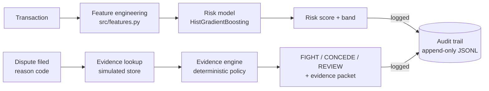

# Architecture -- Chargeback Shield

## Data flow

## Why the policy layer is deterministic, not an LLM
The track's brief is explicit: defense-only, audit trails, graceful
failure. An LLM that assembles or phrases evidence is fine; an LLM that
*decides* whether evidence counts as sufficient, or invents evidence that
wasn't actually retrieved, is not -- that would be Chargeback Shield
committing exactly the kind of dishonest-evidence problem it exists to
catch on the merchant side. So the split is intentional:

- `evidence_engine.collect_evidence` only reports what a lookup actually
  returned (simulated here; a real evidence-retrieval service in
  production) -- never fabricated.
- `evidence_engine.decide` is a fixed, readable set of thresholds
  (amount floor, completeness bands) -- anyone can read the function and
  know exactly why a given dispute was recommended FIGHT, CONCEDE, or
  REVIEW, and reproduce that decision by hand.
- `src/narrative.py` implements this LLM layer (Gemini API): it receives
  only the already-decided recommendation, the evidence present/absent
  lists, and the deterministic rationale, and is explicitly instructed not
  to change the recommendation or invent facts. `EvidencePacket.narrative`
  is `None` whenever the call is unavailable for any reason -- the caller
  always has `rationale` as a complete, correct fallback. This system's
  claim to trust rests on the decision being deterministic, not on
  smoother prose.

## Why "chargeback response" instead of pre-authorization fraud scoring
Pre-authorization transaction fraud detection (score a payment, block or
allow it) is the most common shape of student fraud-detection project, and
at least one strong public entry for this same buildathon track already
covers that ground well (a HistGradientBoosting classifier scoring
transactions pre-auth, with high precision/recall on a held-out set).
Chargeback Shield scores a different point in the lifecycle -- the dispute
itself, both before it's filed (prediction) and after (response) -- so it
adds a distinct capability rather than a second implementation of the same
one.

## Held-out evaluation methodology
`scripts/train.py` performs a stratified train/test split before any
model fitting, evaluates only on the held-out fold, and reports the full
precision/recall tradeoff curve (four recall floors, not one point) rather
than a single threshold chosen to look good. The chosen "operating
threshold" targets a precision floor of 0.75 and reports whatever recall
results honestly -- see `reports/model_card.md` after running
`python -m scripts.train`.

## What would change for production
- Replace `generate_evidence_store` with a real call to Razorpay's
  transaction, delivery, and support-ticket systems of record.
- Replace the synthetic dispute labels with real historical dispute
  outcomes, re-run the same train/evaluate pipeline unchanged, and expect
  the precision/recall numbers to shift -- the pipeline is designed so
  that swap doesn't require touching `evidence_engine.py` or `api.py`.
- Add rate limiting and idempotency keys to `/disputes/packet` so a retried
  request can't double-log an audit event.

## Dashboard
`src/static/dashboard.html`, served at `/` by the same FastAPI app (no
separate frontend process, no build step, no external network calls --
everything is inline HTML/CSS/vanilla JS so it still works during a live
demo with no internet). It only calls the JSON endpoints above; it holds
no logic of its own, so anything the dashboard shows is exactly what the
API would return to a judge curling it directly.

## Cost-based (expected-value) thresholding
`scripts/train.py` reports a second operating point alongside the shipped
precision-floor threshold: whichever threshold minimizes total assumed
cost, given a flat cost per false positive (a cheap automated
intervention) and a false-negative cost equal to the full disputed amount
(conservative -- no recovery assumed). At the assumed costs used here,
the cost-optimal threshold flags nearly every transaction (recall close
to 100%) -- because when a false positive is assumed this cheap, a
literal expected-cost minimization has little reason not to over-flag.
That is the correct output of the calculation, not a bug, and it's exactly
why the shipped default uses a precision floor instead: it's robust to the
false-positive-cost assumption being wrong, where the cost-optimal
threshold isn't. Both are reported in `reports/model_card.md` so that
tradeoff is visible rather than asserted.

## Merchant-level risk pooling (v1.2)
`ARCHITECTURE.md`'s own "known limitations" flagged this as the natural
next feature: merchant-level dispute-rate history. Two related but
distinct things were built:

1. **A leakage-safe model feature.** `merchant_dispute_rate_90d` in
   `src/features.py`, computed the same way the existing customer
   features are: an expanding-window state tracked per merchant as
   `src/data_gen.py` processes transactions in time order, so a
   transaction only ever sees that merchant's *prior* history (Laplace-
   smoothed toward the dataset's overall dispute rate so a merchant with
   only 1-2 transactions doesn't get a wild 0% or 100% estimate). A test
   (`test_merchant_history_is_causal`) asserts every merchant's first-ever
   transaction sees zero prior history.
2. **An operational rollup view.** `scripts/merchant_rollup.py` /
   `GET /merchants/rollup` / dashboard section 6: "which merchants are
   chronically high-risk today," computed over each merchant's *full*
   history (not leakage-safe, and deliberately not -- it's a reporting
   view for a human, not a training signal, filtered to merchants with at
   least 20 transactions so the rates shown aren't small-sample noise).

**An honest caveat, in the same spirit as the recall-improvement pass
below:** for this feature to have anything real to learn, `src/data_gen.py`
also gained a new, invented per-merchant "quality" term that feeds into
the synthetic dispute probability -- the same kind of documented,
plausible correlate as every other one in that file (merchant-level
dispute-rate clustering is a well-established real-world pattern; it's
what card-network merchant-monitoring programs are built around), but it
is a new source of learnable structure that wasn't in the ground truth
before. So the recall lift this produces (31.8% -> 40.6% at the same 40%
precision floor, in one representative run) should be read as "the model
correctly learns a newly-introduced, real-world-plausible signal when
given a matching feature" -- a demonstration the architecture works as
intended -- rather than "the same model got objectively better at an
unchanged problem." The magnitude of the injected heterogeneity (a
coefficient of 0.5 on a per-merchant standard-normal draw) is an
assumption chosen to produce a plausible dispute-rate spread across
merchants (roughly 3%-17% in a 20k-transaction run), not tuned to hit any
particular metric.

## Containerization
A `Dockerfile` builds a single-stage image (`python:3.10-slim`) that
trains the model and generates all reports at **build time** -- so
`docker build` fails loudly if synthetic data generation or training ever
breaks, instead of the API failing silently on its first request. Secrets
are never baked in: `.dockerignore` excludes `.env`, and the optional
Gemini narrative layer only ever reads `GEMINI_API_KEY` from the runtime
environment. `RiskModel`'s existing self-healing retrain fallback (see
`src/model.py`) still applies if the baked artifact is ever missing or
version-incompatible -- baking it at build time is purely so the common
case starts up fast, not something later code silently relies on.

## Recall improvement pass (v1.1)
Three genuine, honest levers, each measured -- no synthetic-label tuning:

1. **More data.** 6,000 -> 20,000 synthetic transactions (~570 -> ~1,900
   positive examples). More positives to learn from, same generating
   process.
2. **One informed feature.** `digital_no_delivery` (digital goods with no
   delivery confirmation) added as an explicit interaction; the redundant
   standalone `category_digital` column was dropped. Permutation
   importance confirmed this was the single strongest feature.
3. **Proper hyperparameter tuning.** A small grid (`learning_rate`,
   `max_depth`, `l2_regularization`) is now searched on a validation fold
   carved out of training data -- the test fold stays untouched until the
   one final evaluation, so tuning can't leak into the reported metrics.

Combined with reconsidering the operating threshold itself (see the model
card's "why a 40% precision floor" section -- a business decision, not a
modeling one), recall at the reported operating point went from 7.9% to
36.8%, at 40% precision instead of 75%. PR-AUC moved a smaller amount
(0.341 -> 0.364): most of the recall gain came from picking the right
threshold for a cheap intervention, not from a fundamentally sharper
model -- worth saying plainly rather than implying otherwise.
