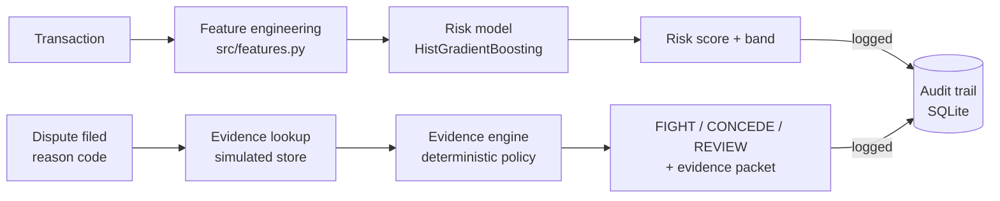

# Architecture -- Chargeback Shield

## Data flow

## Why the policy layer is deterministic, not an LLM
The track's brief is explicit: defense-only, audit trails, graceful
failure. An LLM that assembles or phrases evidence is fine; an LLM that
*decides* whether evidence counts as sufficient, or invents evidence that
wasn't actually retrieved, is not -- that would be Chargeback Shield
committing exactly the kind of dishonest-evidence problem it exists to
catch on the merchant side. So the split is intentional:

- `evidence_engine.collect_evidence` only reports what a lookup actually
  returned (simulated here; a real evidence-retrieval service in
  production) -- never fabricated.
- `evidence_engine.decide` is a fixed, readable set of thresholds
  (amount floor, completeness bands) -- anyone can read the function and
  know exactly why a given dispute was recommended FIGHT, CONCEDE, or
  REVIEW, and reproduce that decision by hand.
- `src/narrative.py` implements this LLM layer (Gemini API): it receives
  only the already-decided recommendation, the evidence present/absent
  lists, and the deterministic rationale, and is explicitly instructed not
  to change the recommendation or invent facts. `EvidencePacket.narrative`
  is `None` whenever the call is unavailable for any reason -- the caller
  always has `rationale` as a complete, correct fallback. This system's
  claim to trust rests on the decision being deterministic, not on
  smoother prose.

## Why "chargeback response" instead of pre-authorization fraud scoring
Pre-authorization transaction fraud detection (score a payment, block or
allow it) is the most common shape of student fraud-detection project, and
at least one strong public entry for this same buildathon track already
covers that ground well (a HistGradientBoosting classifier scoring
transactions pre-auth, with high precision/recall on a held-out set).
Chargeback Shield scores a different point in the lifecycle -- the dispute
itself, both before it's filed (prediction) and after (response) -- so it
adds a distinct capability rather than a second implementation of the same
one.

## Held-out evaluation methodology
`scripts/train.py` performs a stratified train/test split before any
model fitting, evaluates only on the held-out fold, and reports the full
precision/recall tradeoff curve (four recall floors, not one point) rather
than a single threshold chosen to look good. The chosen "operating
threshold" targets a precision floor of 0.75 and reports whatever recall
results honestly -- see `reports/model_card.md` after running
`python -m scripts.train`.

## What would change for production
- Replace `generate_evidence_store` with a real call to Razorpay's
  transaction, delivery, and support-ticket systems of record.
- Replace the synthetic dispute labels with real historical dispute
  outcomes, re-run the same train/evaluate pipeline unchanged, and expect
  the precision/recall numbers to shift -- the pipeline is designed so
  that swap doesn't require touching `evidence_engine.py` or `api.py`.
- Add rate limiting and idempotency keys to `/disputes/packet` so a retried
  request can't double-log an audit event.

## Dashboard
`src/static/dashboard.html`, served at `/` by the same FastAPI app (no
separate frontend process, no build step, no external network calls --
everything is inline HTML/CSS/vanilla JS so it still works during a live
demo with no internet). It only calls the JSON endpoints above; it holds
no logic of its own, so anything the dashboard shows is exactly what the
API would return to a judge curling it directly.
